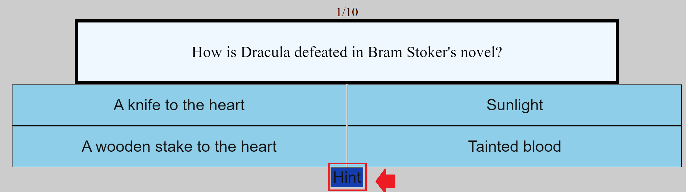

# The Testing Grounds

--Description
A simple trivia game that I made to test my understanding of Javascript and the DOM. I chose a trivia game because I initially wanted to do a text adventure but that seemed too ambitious for the alloted time. 
The game is played entirely with the mouse and the questions will be based on one of two pre-determined themes selected by the player at the start (Literature and Film). Each one has ten questions with four possible answers. The player's score will be displayed at the end.

Future updates to the game have added a hint button as well. When clicked, the button will display a brief message or, in the case of one question a link to a video, that will help the player by providing additional information or subtly hinting at the answer.

Clicking this button will have no impact on the player's score but the number of times the button was used will be displayed at the end along with their score. 

--Technologies
The game was written mostly with Javascript but also utilizes html and CSS for the user experience and design. A later update converted much of the CSS to SCSS and also gave me an opportunity to slightly improve the stylization. The buttons will now darken when hovered over by the user's mouse cursor allowing for better readability and a more responsive design. 

--Technical Information
The program is written in vanilla javascript. Code for both sections is contained within the appropriately named js files. For ease of reading answers and questions should be written in the sections indicated by the comments.

--Issues
I ran into issues with stylization. I was unable to make my custom borders work and wound up settling for some of the default border types available for CSS and there was not enough time at the end for me to do anything particularly interesting with the aesthetics. In hindsight I probably should have spent more time planning the layout of my game. Because I knew the actual programming with Javascript would be the hardest part I did not consider the amount of time customizing the layout and optimizing the site for mobile players would require. This project also showed me the importance of class and id selectors. Future updates will aim to further improve the visuals.
